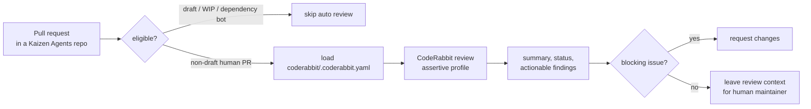

# Kaizen Agents CodeRabbit Configuration

This repository stores the shared CodeRabbit configuration for `kaizen-agents-org`.

CodeRabbit uses `.coderabbit.yaml` from this repository as the organization-level configuration source for repositories that do not define their own `.coderabbit.yaml`.

## Review Flow



## What The Configuration Does

| Area | Setting | Effect |
|---|---|---|
| Review profile | `reviews.profile: assertive` | Favors direct, actionable findings. |
| Review workflow | `request_changes_workflow: true` | Allows CodeRabbit to request changes for blocking findings. |
| Summaries | `high_level_summary: true`, `review_status: true` | Adds PR-level summary and status output. |
| Noise reduction | `review_details: false`, `poem: false`, `chat.art: false` | Avoids decorative or verbose review output. |
| Auto review | `auto_review.enabled: true` | Reviews eligible non-draft PRs automatically. |
| Incremental review | `auto_incremental_review: true` | Reviews new pushes after the initial review. |
| Skip rules | draft PRs, WIP titles, dependency bots | Keeps routine or unfinished PRs out of review. |
| Path instructions | JS/TS and Markdown rules | Biases review toward contracts, CLI behavior, tests, and stale docs. |
| Knowledge base | `AGENTS.md`, README, docs | Lets CodeRabbit learn repository conventions from committed guidance. |

## Required Setup

1. Install the CodeRabbit GitHub App for `kaizen-agents-org`.
2. Include the `kaizen-agents-org/coderabbit` repository in the installation.
3. Include every repository that should receive CodeRabbit reviews:
   - `.github`
   - `builder-agent`
   - `kaizen-loop`
   - `renovate-config`
   - `verifier`
4. Treat `coderabbit` as a special case: it must be included in the app
   installation so shared configuration changes are reviewed and validated, but
   it is the configuration source rather than a downstream repository inheriting
   that configuration.
5. Open a pull request in a configured repository and confirm CodeRabbit reports
   `Repository: coderabbit/.coderabbit.yaml` as the configuration source.

## Review Behavior

CodeRabbit automatically reviews non-draft pull requests targeting each repository's default branch.

Reviews are skipped when:

- The PR is a draft.
- The title contains `WIP`, `DO NOT MERGE`, or `[skip review]`.
- The author is `dependabot[bot]` or `renovate[bot]`.

Manual review commands:

```md
@coderabbitai review
@coderabbitai full review
```

## Change Guidelines

When changing `.coderabbit.yaml`:

1. Keep the YAML schema line at the top of the file.
2. Prefer organization-wide rules only; repository-specific exceptions should usually live in the target repository.
3. Keep review instructions focused on correctness, security, release risk, tests, CLI behavior, and documentation drift.
4. Validate YAML syntax before opening a PR.
5. Confirm that CodeRabbit still recognizes this repository as the configuration source after merge.

## Codex Review Setup

Codex code review is configured in ChatGPT, not in this repository:

1. Set up Codex cloud for each repository.
2. Open <https://chatgpt.com/codex/settings/code-review>.
3. Turn on Code review for each repository.
4. Optionally turn on Automatic reviews.

Manual Codex review command:

```md
@codex review
```

Codex reads each repository's `AGENTS.md` review guidance when reviewing pull requests.
